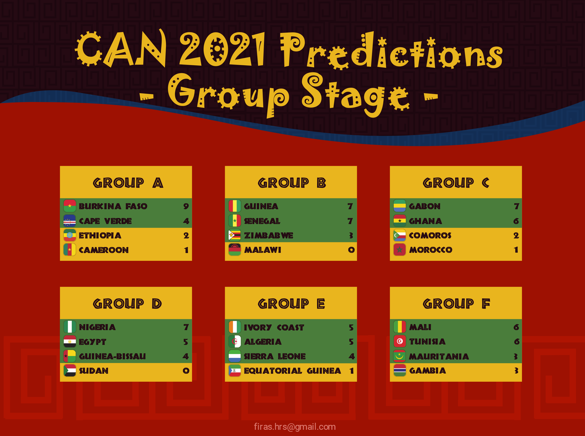
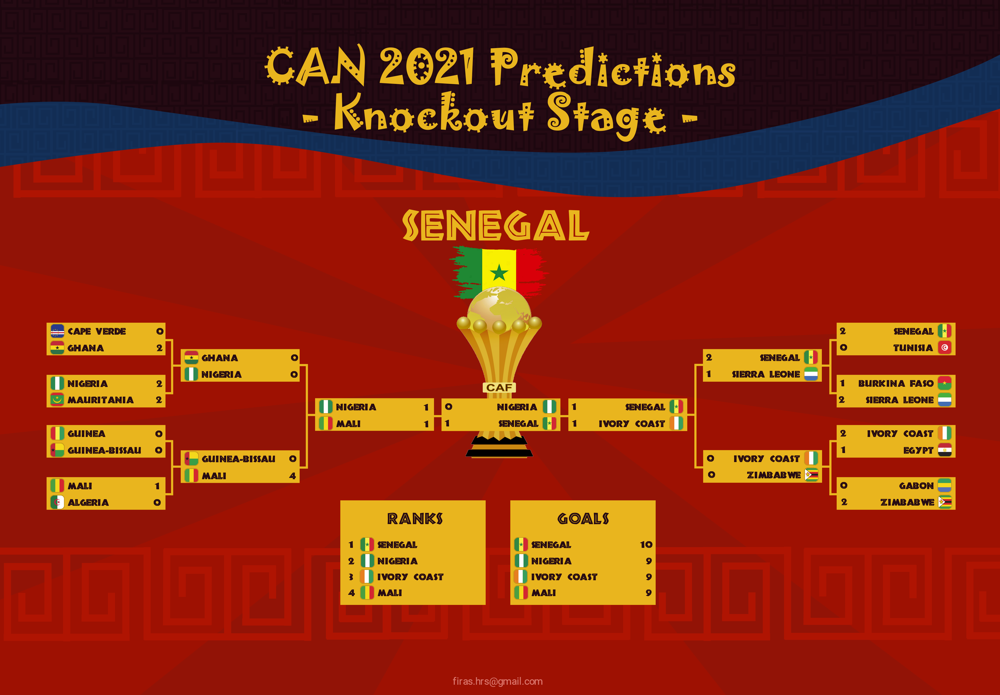

# CAN_2021_Predictions
A python project that uses Artificial Intelligence To predict the results of the 2021 Africa Cup of Nations. This includes the results of all the matches to be played and the final ranking of the top four.

The model is created based on <b>the details of all  international football games</b> played from 1992 to 2021, as well as the  <b>FIFA Ranking of national teams</b> during the same years.

The Artificial Intelligence model is:

* <b>97.2 %</b> accurate in predicting the winner of any match.
* <b>92.9 %</b> accurate in predictiing the exact score of any match.

Some of the Features, that helped train the model, are differences between the facing teams in:

* FIFA National Teams Ranking at the date of the match.
* Number of matches played during the past year
* Number of matches won during the past year
* Number of Matches lost during the past year

Other features include the previous score of the last head-to-head match between the two teams.

